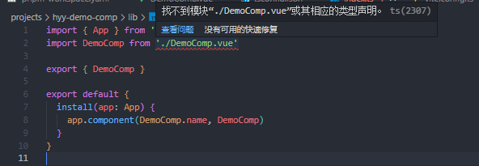

---
# 当前页面内容标题
title: 找不到模块“xxx.vue”或其相应的类型声明问题解决
# 当前页面图标
icon: write
# 分类
category:
  - Vue3
# 标签
tag:
  - Vue3
sticky: false
# 是否收藏在博客主题的文章列表中，当填入数字时，数字越大，排名越靠前。
star: true
# 是否将该文章添加至文章列表中
article: true
# 是否将该文章添加至时间线中
timeline: true
---

### 问题：



---

### 解决方法：

在项目根目录或 src 文件夹下创建一个后缀为 .d.ts 的文件，并写入以下内容：

```typescript
/// <reference types="vite/client" />

declare module "*.vue" {
  import { App, defineComponent } from "vue";
  const component: ReturnType<typeof defineComponent> & {
    install(app: App): void;
  };
  export default component;
}
```

做了上面的操作后，如果依然报错，那将这个文件的路径添加到`tsconfig.json`文件的`include`中。
